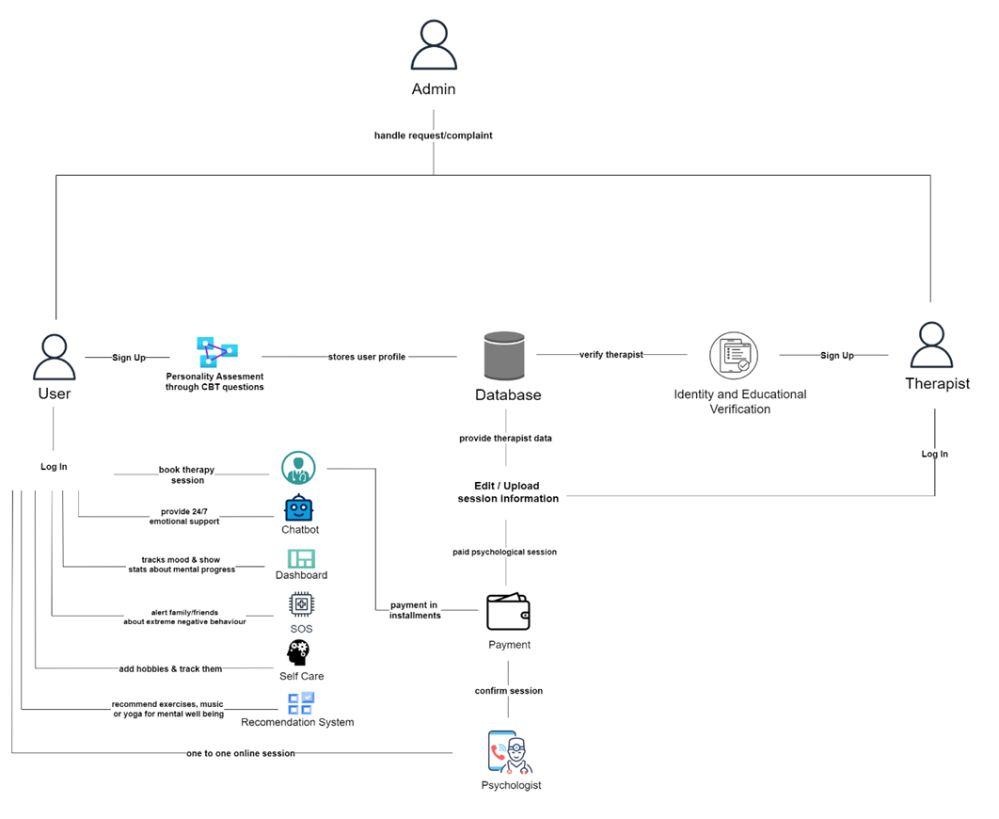

# serenella-mental-health-app
<h2>OVERVIEW</h2>
This is our Final Year Project, it is a mental health application assistance for women. The app targets women to provide them a safe and sound platform to address their mental health problems which are often seen as a taboo.

<h2>GOALS & OBJECTIVES</h2>
<ul> 
<li>Providing 24/7 emotional and optional human support.</li>
<li>Teach users evidence-based coping strategies and techniques from cognitive-behavioral therapy (CBT), dialectical behavior therapy (DBT), and mindfulness practices.</li>
<li>Tailor conversations and recommendations to each user's individual needs and preferences.</li>
<li>Talk to a person and restructure the negative thoughts into positive to relieve stress and procrastination.</li>
<li>Promote good sleep hygiene, regular exercise, and other lifestyle factors that contribute to mental health.</li>
<li>Allow users to monitor their mood and progress over time through journaling and mood tracking features.</li> 
</ul>

<h2>TOOLS & TECHNOLOGIES </h2>
<ul> 
<li>React-Native</li>
<li>Firebase</li>
<li>Google Cloud Platform</li>
<li>Typescript</li>
</ul>

<h2>ARCHITECTURE DIAGRAM</h2>
The Architecture Diagram for the project provides a description of app modules and features
 
